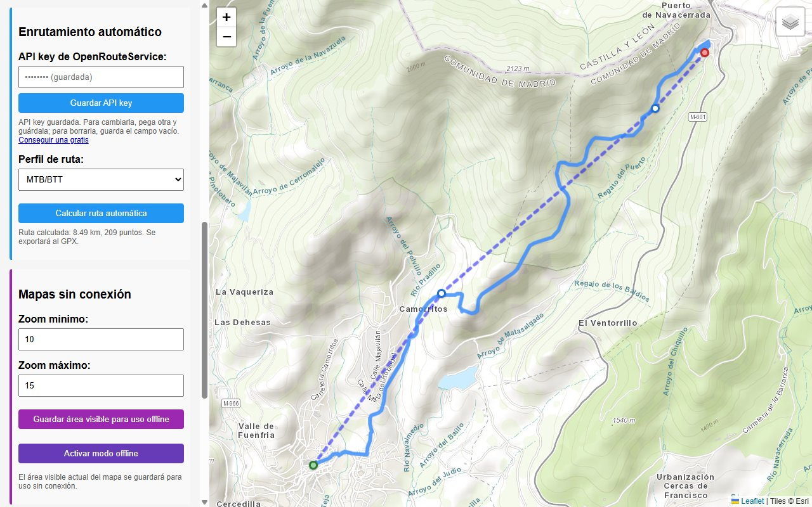
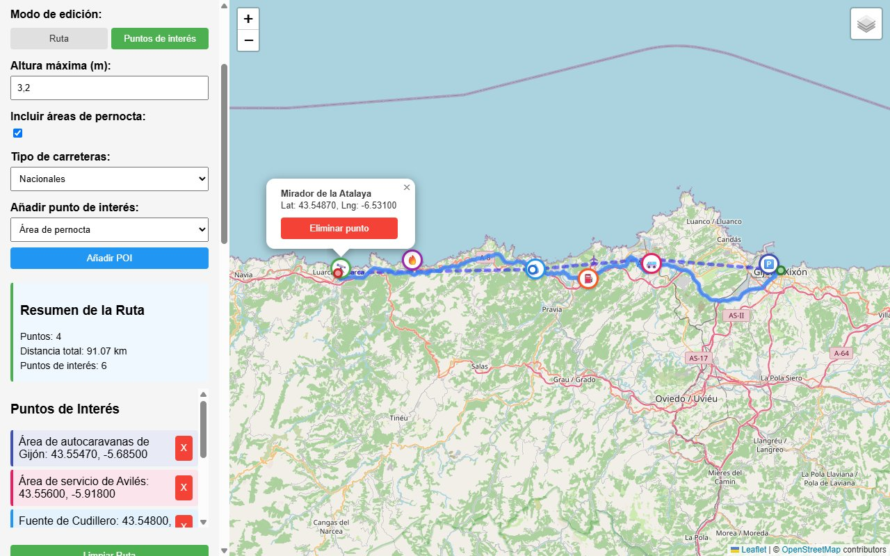
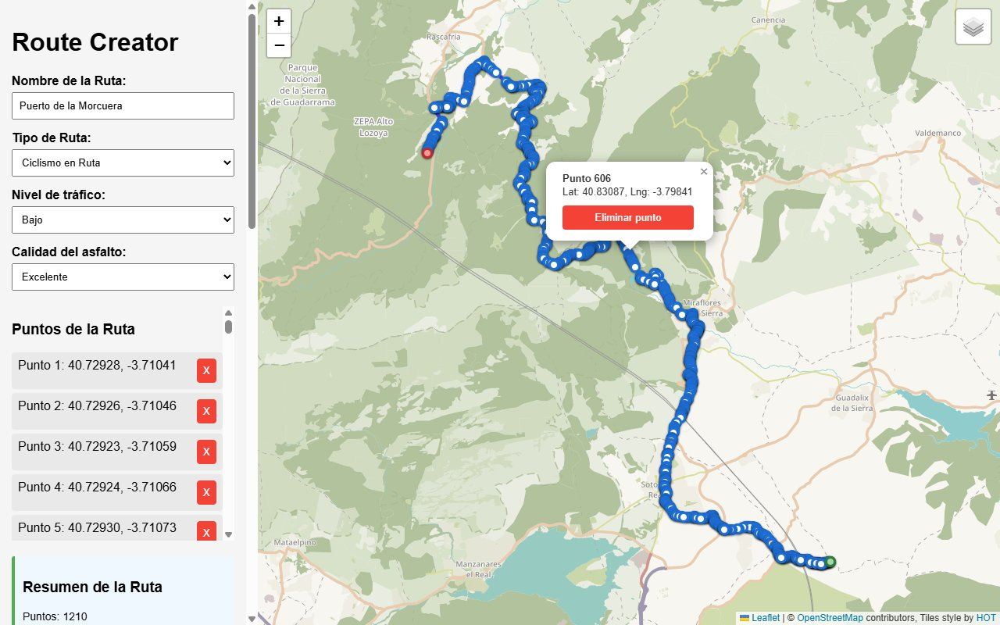
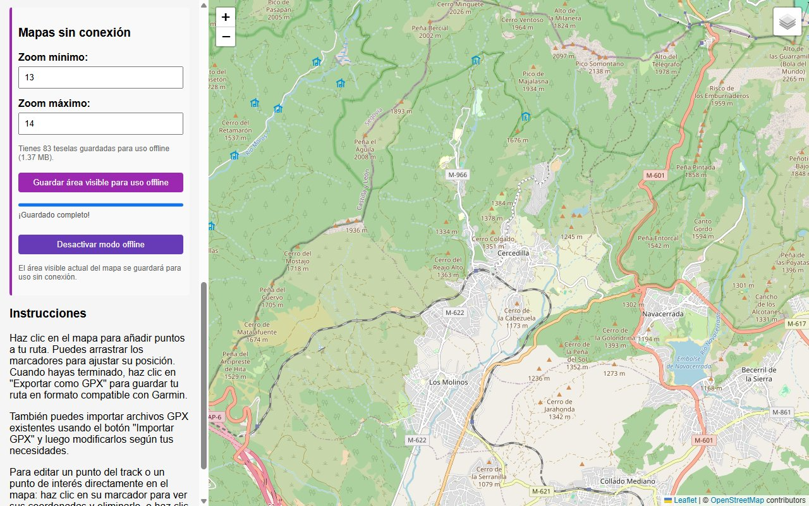

# Route Creator

Route Creator es una aplicación de escritorio para crear, editar y gestionar rutas para MTB, ciclismo en ruta y
autocaravanas. Permite diseñar tus propias rutas sobre el mapa, calcularlas por caminos y carreteras, añadir puntos de
interés y exportarlas en formato GPX 1.1 para dispositivos GPS y aplicaciones de navegación.

🌐 **Web y descargas:** https://cmurestudillos.github.io/route-creator/



## ✨ Características

- 🗺️ **Un mapa para cada actividad** (se puede cambiar desde el control de capas):
  - Topográfico (Esri) para MTB
  - OSM Humanitarian para ciclismo en ruta
  - OpenStreetMap para autocaravana

- 📍 **Edición directa en el mapa**:
  - Añade puntos haciendo clic en el mapa (inicio en verde, final en rojo)
  - Arrastra los puntos para ajustarlos
  - Clic en un punto para ver sus coordenadas y eliminarlo, o clic derecho para eliminarlo al instante
  - Distancia total de la ruta

- 🧭 **Enrutamiento automático** con [OpenRouteService](https://openrouteservice.org/):
  - Perfiles: automóvil, vehículo pesado, ciclismo en ruta, MTB/BTT y a pie (senderismo)
  - Hasta 50 puntos de paso
  - El GPX exporta la geometría completa de la ruta calculada con la altitud de cada punto
  - Requiere una API key gratuita (ver [Configuración](#-configuración))

- 🚏 **Puntos de interés (POIs)** para rutas en autocaravana, cada uno con su color y su símbolo Garmin en el GPX:
  - Áreas de pernocta, áreas de servicio, puntos de agua, gasolineras, puntos de recarga de GLP y miradores

- 💾 **Importación/Exportación GPX**:
  - Exporta GPX 1.1 válido según el esquema oficial, con los metadatos del tipo de ruta
  - Importa tracks (`<trk>`) o rutas (`<rte>`) GPX, también de miles de puntos, y sus waypoints como POIs

- 📶 **Mapas sin conexión**:
  - Guarda el área visible del mapa entre los niveles de zoom que elijas
  - Modo offline que muestra el mapa desde las teselas guardadas

## 📸 Capturas

| Ruta de MTB calculada                                         | Autocaravana con puntos de interés                                         |
| ------------------------------------------------------------- | -------------------------------------------------------------------------- |
|        |  |
| **GPX importado (1210 puntos)**                               | **Mapas sin conexión**                                                     |
|  |              |

## 🚀 Instalación

Descarga el instalador de tu sistema desde la [web](https://cmurestudillos.github.io/route-creator/#/descargas) o desde
[Releases](https://github.com/cmurestudillos/route-creator/releases): `.exe` (Windows), `.dmg` (macOS Apple Silicon) o
`.AppImage` (Linux). Los instaladores no están firmados: en la web están las notas para SmartScreen, Gatekeeper y
permisos de ejecución.

### Desde el código

Requisitos: [Node.js](https://nodejs.org/) 22.12 o superior y [pnpm](https://pnpm.io/) 11 o superior.

```bash
git clone https://github.com/cmurestudillos/route-creator.git
cd route-creator
pnpm install
pnpm start
```

### Generación de ejecutables

```bash
pnpm package:win     # Windows (.exe)
pnpm package:mac     # macOS (.dmg, requiere macOS)
pnpm package:linux   # Linux (.AppImage)
```

Los ejecutables se generan en `release/`.

## 🔑 Configuración

El cálculo automático de rutas necesita una API key gratuita de OpenRouteService:

1. Crea una cuenta en [openrouteservice.org](https://openrouteservice.org/dev/#/signup) y copia tu API key.
2. En la app, pégala en **API key de OpenRouteService** (sección _Enrutamiento automático_) y pulsa **Guardar API key**.
   Se guarda en `settings.json` dentro de la carpeta de datos de la app; para borrarla, guarda el campo vacío.

En desarrollo también puedes usar `config.json` (está en `.gitignore` y se excluye del instalador):

```bash
cp config.example.json config.json   # y pon tu clave en openRouteServiceApiKey
```

La clave guardada desde la app tiene prioridad sobre `config.json`. La clave nunca llega al renderer: el proceso
principal la añade a la petición.

## 🛠️ Scripts disponibles

| Script               | Descripción                                   |
| -------------------- | --------------------------------------------- |
| `pnpm start`         | Inicia la aplicación en modo desarrollo       |
| `pnpm lint`          | Verifica el código con ESLint                 |
| `pnpm lint:fix`      | Corrige automáticamente los errores de ESLint |
| `pnpm format`        | Formatea el código con Prettier               |
| `pnpm format:check`  | Verifica el formato sin modificar archivos    |
| `pnpm package:win`   | Genera ejecutable para Windows                |
| `pnpm package:mac`   | Genera ejecutable para macOS                  |
| `pnpm package:linux` | Genera ejecutable para Linux                  |

## 🛠️ Uso

### Crear una nueva ruta

1. Selecciona el tipo de ruta (MTB, Ciclismo en Ruta o Autocaravana)
2. Configura las opciones específicas para ese tipo de ruta
3. Haz clic en el mapa para añadir puntos a tu ruta
4. Ajusta los puntos arrastrándolos si es necesario

### Editar o eliminar puntos del track y POIs en el mapa

1. Haz clic sobre el marcador de un punto para abrir un popup con sus coordenadas y un botón "Eliminar punto"
2. Para mover un punto, arrástralo a su nueva posición (el popup se actualiza automáticamente)
3. Para eliminar un punto rápidamente sin abrir el popup, haz clic derecho sobre su marcador

### Añadir puntos de interés (para rutas de autocaravana)

1. Selecciona el modo "Puntos de interés" y elige el tipo de POI: cada clic en el mapa añade uno
2. O pulsa "Añadir POI": el siguiente clic en el mapa coloca el punto y vuelves al modo anterior

### Cálculo automático de rutas

1. Guarda tu API key de OpenRouteService (ver [Configuración](#-configuración))
2. Añade entre 2 y 50 puntos
3. Selecciona el perfil de ruta adecuado (se elige solo según el tipo de ruta)
4. Haz clic en "Calcular ruta automática"
5. La ruta calculada se dibuja sobre tus puntos, que se mantienen como puntos de paso. Si mueves, añades o quitas un
   punto, hay que volver a calcularla

### Guardar mapas para uso offline

1. Navega al área que quieres guardar
2. Ajusta los niveles de zoom a descargar (la app avisa antes de descargas grandes)
3. Haz clic en "Guardar área visible para uso offline"
4. Activa el modo offline con el botón correspondiente cuando lo necesites

### Exportar a GPX

1. Una vez completada tu ruta, haz clic en "Exportar como GPX"
2. Selecciona la ubicación donde guardar el archivo
3. El GPX incluye el track (la ruta calculada completa o tus puntos), los POIs como waypoints con símbolo Garmin y los
   datos del tipo de ruta

## 🧩 Tecnologías utilizadas

- [Electron](https://www.electronjs.org/) v43 — Framework para crear aplicaciones de escritorio con tecnologías web
- [Leaflet](https://leafletjs.com/) v1.9 — Biblioteca JavaScript para mapas interactivos
- [OpenStreetMap](https://www.openstreetmap.org/) — Datos de mapas
- [OpenRouteService](https://openrouteservice.org/) — API para el cálculo automático de rutas
- [localForage](https://localforage.github.io/localForage/) — Almacenamiento de las teselas offline
- [fast-xml-parser](https://github.com/NaturalIntelligence/fast-xml-parser) — Generación de archivos GPX (XML)

## 🌐 Web (GitHub Pages)

La landing está en `docs/` (HTML, CSS y JS sin dependencias ni build) y se publica con GitHub Pages desde la rama
`master`, carpeta `/docs`. Lee la última versión publicada de la API de releases de GitHub para rellenar los enlaces de
descarga, así que no hay que tocarla al publicar una versión.

### Regenerar las capturas

Las capturas de `docs/assets/screenshots/` son reales: se generan con un script de Electron que **no está en el
repositorio** y se carga sobre la app con `electron -r <script>.js .` desde la raíz del proyecto. El script:

- sustituye `dialog.showOpenDialog` para importar un GPX de ejemplo y el estado de la API key (para que se vea
  "guardada" en lugar de `config.json`),
- maneja la interfaz con `webContents.executeJavaScript` (tipo de ruta, puntos, POIs, cálculo con OpenRouteService,
  descarga offline),
- espera a que carguen las teselas y llama a `webContents.invalidate()` antes de `capturePage()` (si no, captura el
  fotograma anterior),
- guarda JPEG de 1280×800 con calidad 85.

## 📦 Publicar una versión

Los instaladores de Windows, macOS y Linux los genera GitHub Actions (`.github/workflows/release.yml`) al subir un tag:

1. Sube la versión en `package.json` (la app la muestra con `app.getVersion()`) y haz commit.
2. Crea el tag, que debe coincidir con `package.json` (el workflow lo comprueba): `git tag -a v1.2.0 -m "v1.2.0"`.
3. Sube la rama y el tag: `git push origin develop` y `git push origin v1.2.0`.
4. En _Actions_ aparece **Release v1.2.0** con 4 jobs (borrador + Windows + macOS + Linux).
5. Revisa el borrador en _Releases_ (`Route-Creator-Setup-X.Y.Z.exe`, `Route-Creator-X.Y.Z-arm64.dmg`,
   `Route-Creator-X.Y.Z.AppImage`) y pulsa **Publish release**. La web pasa sola a la nueva versión.

Si un build falla: corrige, borra el tag (`git tag -d vX.Y.Z && git push origin :refs/tags/vX.Y.Z`), vuelve a crearlo
sobre el commit bueno y súbelo.

## 🔧 Calidad de código

El proyecto usa **ESLint v9** (flat config) + **Prettier**:

```bash
pnpm lint           # verificar
pnpm lint:fix       # auto-corregir
pnpm format:check   # verificar formato
```

La configuración de ESLint está en `eslint.config.mjs` y aplica reglas diferenciadas para el proceso principal
(Node.js), el renderer y la landing (navegador).

## 📄 Licencia

Este proyecto está licenciado bajo la Licencia MIT.

## 🤝 Contribuir

Las contribuciones son bienvenidas. Por favor, abre un issue o envía un pull request para sugerir cambios o mejoras.

1. Haz un fork del proyecto
2. Crea tu rama de características (`git checkout -b feature/amazing-feature`)
3. Haz commit de tus cambios (`git commit -m 'Add some amazing feature'`)
4. Haz push a la rama (`git push origin feature/amazing-feature`)
5. Abre un Pull Request

## 📊 Roadmap

- [ ] Gráfico de perfil de elevación
- [ ] Usar la altura máxima de la autocaravana al calcular la ruta
- [ ] Estimación de tiempo/esfuerzo
- [ ] Guardar y recuperar la ruta en curso entre sesiones
- [ ] Exportación a otros formatos además de GPX (KML, TCX)
- [ ] Integración con Strava y otras plataformas
